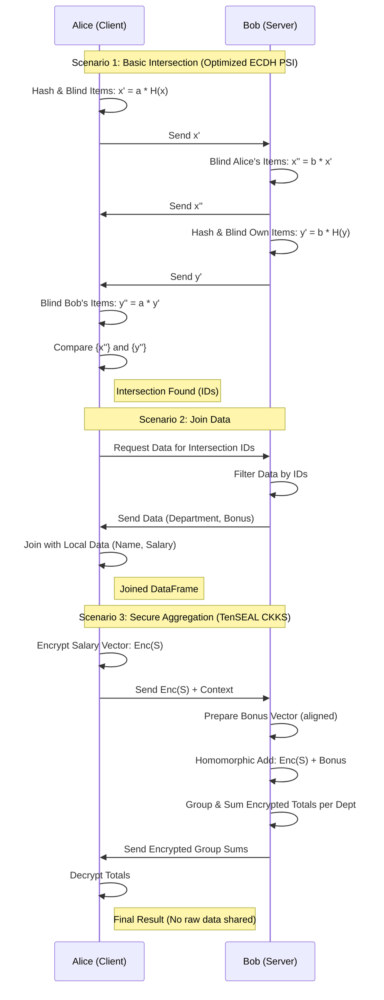

# Private Set Intersection (PSI) Example Walkthrough

This example demonstrates a Private Set Intersection (PSI) protocol between two parties, Alice and Bob, using Elliptic Curve Diffie-Hellman (ECDH).

## Overview

- **Alice**: Client (Local machine). Has 1000 rows of data (ID, Name, Age, Salary).
- **Bob**: Server (Remote machine). Has 1000 rows of data (ID, Department, Bonus).
- **Intersection**: ~500 common IDs.
- **Protocol**: ECDH-based PSI. No data is revealed except the intersection (and joined data in Scenario 2).

## Files

- `psi_protocol.py`: Core cryptographic logic (Custom EC implementation).
- `data_generator.py`: Generates dummy data.
- `network_utils.py`: Networking helpers.
- `bob.py` / `bob_app.py`: Server script / UI.
- `alice.py` / `alice_app.py`: Client script / UI.

## Usage (UI Version)

### 1. Start Bob (Server)
Run this on the machine acting as Bob.
```bash
streamlit run bob_app.py --server.port 8501
```
- Open the URL (e.g., `http://localhost:8501`).
- Click **Start Server** in the sidebar.
- You will see logs and Bob's data.

### 2. Start Alice (Client)
Run this on the machine acting as Alice.
```bash
streamlit run alice_app.py --server.port 8502
```
- Open the URL (e.g., `http://localhost:8502`).
- **Step 1**: Click **Generate Alice's Data**.
- **Step 2**: Enter Bob's Host/Port (default is correct for local test) and click **Connect to Bob**.
- **Step 3**: Run Scenarios:
    - **Scenario 1**: Click **Run PSI Protocol**. Wait for progress bar.
    - **Scenario 2**: Click **Fetch Joined Data**. View the table.
    - **Scenario 3**: Click **Run Aggregation**. View the summary.

## Usage (CLI Version)

You can still run the scripts directly without UI:
```bash
python bob.py
python alice.py
```

## Scenarios

### Scenario 1: Basic Intersection
Alice and Bob compute the intersection of their IDs.
- Alice sends blinded items.
- Bob returns double-blinded items.
- Bob sends his blinded items.
- Alice finds matches.

### Scenario 2: Join Data
Alice requests the payload (Department, Bonus) for the intersecting IDs.
- Alice sends intersection IDs to Bob.
- Bob returns the data.
- Alice joins it with her local data (Name, Salary).

### Scenario 3: Group By and Sum
Alice aggregates the joined data.
- Group by `Department`.
- Sum `Salary + Bonus`.

## Notes
- The cryptographic operations use `cryptography` (OpenSSL bindings) and `tenseal` (OpenMined CKKS) for high performance.
- Processing is now significantly faster due to C++ backends.
- `openmined-psi` is recommended if available, but `cryptography` provides an optimized fallback for standard ECDH PSI.

## Protocol Diagram


